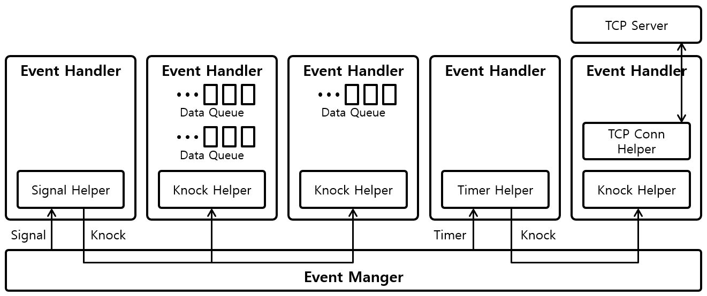

# event-cpp 

event-cpp is the simple event-driven cpp framework on Linux.

 

## Components

### Event

The event components is literally associated with events. They deliver or manage events. **Event manager, Event handler** are the event components.

### Helper

The helper components helps app developer add events easily. Now event-cpp supports **Timer, Signal, Knock, TcpConn** Helpers. 

### Logger

event-cpp supports the simple logger. The event components use this logger to recording event processing. Also app developer can use this logger anywhere in the event-cpp base app.

## Build and run

* Install packages for build
~~~
# apt install cmake
# apt install clang
~~~

* Get source and compile
~~~
# git clone https://github.com/ssup2/event-cpp.git
# cd event-cpp
# mkdir build && cd build
# cmake ..
# make
~~~

* Copy header and lib
~~~
# cp build/framework/lib/* [Target Dir]
# cp build/framework/header/* [Target Dir]
~~~

* Run examples
~~~
# ./build/examples/[Examples]
~~~

